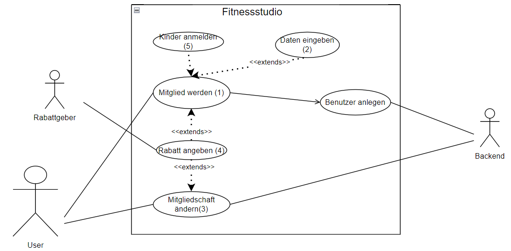
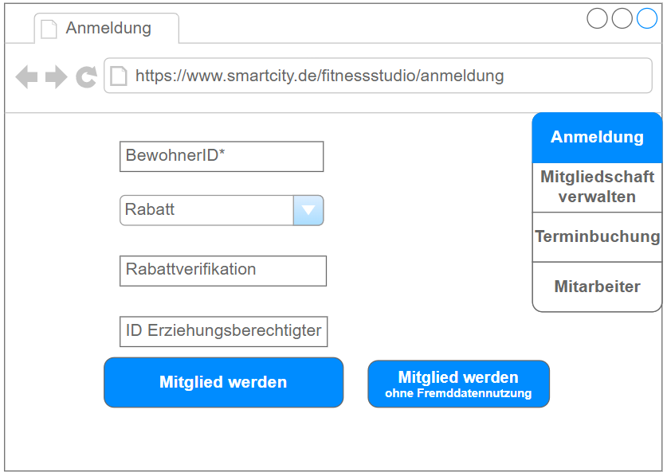
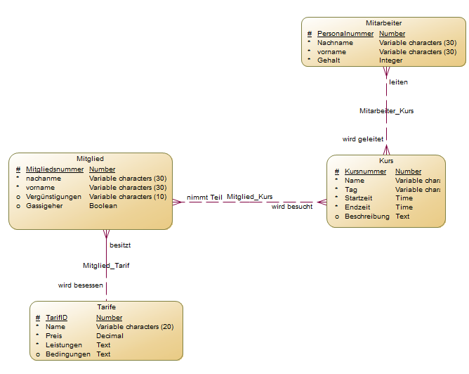

# Fitnessstudio

**Autor:** Tom Luca Horstmann

## Überblick

Die Seite des Fitnessstudios dient dazu, die Mitgliedschaft in dem Fitnessstudio zu vereinfachen. 
So können die Mitgliedschaft komplett online verwaltet und die Aktivitäten online gebucht werden. 
Für maximalen Komfort sorgt die Vernetzung mit den anderen Microservices. So reicht der Name zur 
Anmeldung aus, da die restlichen Daten vom Bürgerbüro und Finanzamt geholt werden. Außerdem ist es 
möglich verschiedene Sondertarife zu buchen, und sich für Kooperationen anzumelden.

- Konzeptionelles Analyseklassendiagramm (logische Darstellung der Konzepte der Anwendungsdomäne)

## Funktionale Anforderungen

### Akteure
| **Akteur** | **Definition**  |
| :-------: | :------- |
| User | Nutzer der den Service nutzt und Zugriff auf seine Mitgliedschaft hat |
| Mitarbeiter | Mitarbeiter des Fitnessstudios, hat administrative Rechte auf einer gesonderten Mitarbeiterseite |
| Tierheim | Das Tierheim besitzt eine Kooperation durch die ihr bereitwillige Gassigeher mitgeteilt werden |
| Rabattgeber | Institutionen, die ihren "Mitgliedern" Rabatt gewähren, aktuell Flüchtlinge und Mitarbeiter des Stadtbusses |
| Newsletter | Der Newsletter Microservice welcher Interessierte regelmäßig über Neuigkeiten informiert |
| Landingpage | Die Startseite der Anwendung |

### Use-Case Diagramme

####Mitgliedschaftsverwaltung

 <!-- use case-Digramm -->

####Sportaktivitäten

 <!-- use case-Digramm -->

####Mitarbeiteraktionen

 <!-- use case-Digramm -->

## Anforderungen im Detail

**Mitgliedschaft verwalten**

| **ID**| **Als**|   **möchte ich**   |  **so dass** | **Akzeptanz** | **Priorität**   |
|:-----|:----------:|:-------------------|:-------------|:---------|:----------------|
| 1  |User| nur mit meinem Namen Mitglied werden|ich die Dienste des Studios nutzen kann| Mitglied wird angelegt | Muss |
| 2  |User| mich ohne Fremddatennutzung anmelden können|ich die Dienste des Studios nutzen kann| Mitglied wird angelegt | Muss |
| 3  |User| meine Mitgliedschaft verwalten können|ich meine Mitgliedschaft ändern kann| Mitgliedschaft wird passend geändert | Muss |
| 4  |User| "Mitgliedschaften" angeben können|ich Sondertarife entscheide| Sondertarif wird hinterlegt | Sollte |
| 5  |User| möchte ich von meinen Erzeihungsberechtigten angemeldet werden können|ich auch als Nichtgeschäftsfähiger Mitglied werden kann| Mitglied wird angelegt | Sollte |

**Sportaktivitäten verwalten**

| **ID**| **Als**|   **möchte ich**   |  **so dass** | **Akzeptanz** | **Priorität**   |
|:-----|:----------:|:-------------------|:-------------|:---------|:----------------|
| 6  |User| Kurse angezeigt bekommen|ich einen auswählen kann| Kurse werden angezeigt | Sollte |
| 7  |User| Kurse buchen können|ich an diesen teilnehmen kann| Mitglied wird im Kurs gespeichert | Sollte |
| 8  |User| mich für das Tierheimprogramm anmelden|ich bei Verfügbarkeit benachrichtigt werde | Mitglied wird Tierheim gemeldet| Sollte |
| 9  |User| mich für das Tierheimprogramm abmelden|ich nicht mehr verfügbar bin | Mitglied wird Tierheim gemeldet| Sollte |

**Servicekommunikation**

| **ID**| **Als**|   **möchte ich**   |  **so dass** | **Akzeptanz** | **Priorität**   |
|:-----|:----------:|:-------------------|:-------------|:---------|:----------------|
| 10  |Tierheim| über bereitwillige Gassigeher informiert werden|ich diesen ein Tier zuweisen kann| Tierheim wird über Person informiert | Sollte |
| 19  |Gemeinschaft| meinen Mitgliedern Rabatte ermöglichen|diese günstigere Tarife haben| Rabatt wird gewährt | Sollte |

**Mitarbeiterseite**

| **ID**| **Als**|   **möchte ich**   |  **so dass** | **Akzeptanz** | **Priorität**   |
|:-----|:----------:|:-------------------|:-------------|:---------|:----------------|
| 11  |Mitarbeiter| mich anmelden können| ich in einen gesichterten Mitarbeiterbereich geleitet werde| Weiterleitung auf separate Mitarbeiterseite| Sollte |
| 12  |Mitarbeiter| Mitglieder verwalten können| ich deren Daten ändern kann| Daten werden geändert| Sollte |
| 13  |Mitarbeiter| Kurse verwalten können| ich deren Daten ändern kann| Daten werden geändert| Sollte |
| 14  |Mitarbeiter| besondere Termine bekanntmachen| diese allgemein eingesehen werden können| Event wird verschickt| Sollte |
| 15  |Mitarbeiter| das about us ändern können| die Landingpage es richtig anzeigt| about us wird aktualisiert| Sollte |

**Missue-Stories**

| **ID**| **Als**|   **könnte ich**   |  **so dass** | **Fehler** | **Bewertung**   |
|:-----|:----------:|:-------------------|:-------------|:---------|:----------------|
| 16  |User| mich mehrfach anmelden|ich mehrere Tarife zahlen muss|	mehrere Tarife von gleicher Person | Schlecht |
| 17  |User| mich mehrfach für einen Kurs anmelden| Plätze freibleiben| gleiche Person mehrmals in einem Kurs | Schlecht |
| 18  |Mitarbeiter| Benutzerdaten falsch abändern| Fehler im System entstehen| Daten stimmen nicht mit der Realität überein | Schlecht |

## Graphische Benutzerschnittstelle

#### Home
 <!-- home -->

#### Mitgliedschaft verwalten
[User Story 1](#mitgliedschaft-verwalten-1)
 <!-- anmeldung -->

## Datenmodell 

- Begriffe im Glossar darstellen
- Modellierung des physikalischen Datenmodells 
  - RDBMS: ER-Diagramm bzw. Dokumentenorientiert: JSON-Schema
  
 <!-- ER-Digramm -->

## Abläufe

- Aktivitätsdiagramm für den Ablauf sämtlicher Use Cases
- Aktivitätsdiagramme für relevante Use Cases
- Aktivitätsdiagramm mit Swimlanes sind in der Regel hilfreich 
  für die Darstellung der Interaktion von Akteuren der Use Cases / User Stories
- Abläufe der Kommunikation von Rechnerknoten (z.B. Client/Server)
  in einem Sequenz- oder Aktivitätsdiagramm darstellen
- Modellieren Sie des weiteren die Diagramme, die für das (eigene) Verständnis des
  Softwaresystems hilfreich sind. 

## Schnittstellen

- Schnittstellenbeschreibung (API), z.B. mit OpenAPI 
- Auflistung der nach außen sichtbaren Schnittstelle des Microservices. Über welche Schnittstelle kann z.B. der Client den Server erreichen?
- In Event-gesteuerten Systemen ebenfalls die Definition der Ereignisse und deren Attribute
- Aufteilen in Commands, Events, Queries
* Abhängigkeiten: Liste mit Kommunikationsabhängigkeiten zu anderen Microservices

**Beispiel:**

### URL

http://smart.city/microservices/customer

### Commands

### Events

| **Service** | **Payload** | **Description** | 
| :------ | :----- | :----- |
| Newsletter | 	{ event_id: 7000, event_name:"New Newsletter Entry", service_name: fitnessstudio, title: title, text: text } | Neuer Newsletter-Eintrag/Werbung |
| Newsletter | 	{ event_id: 7001, event_name:"New Calendar Entry", service_name: fitnessstudio, title: title, text: text, date: date } | Neuer Kalendereintrag |
| Tierheim | 	{ event_id: 7002, event_name:"New Volunteer for walk", service_name: fitnessstudio, personal_number: number} | Neuer Kalendereintrag |
| Landingpage | 	{ event_id: 7003, event_name:"New About us", service_name: fitnessstudio, text: text} | Neues about us |

### Queries

### Dependencies

## Technische Umsetzung

### Softwarearchitektur

- Darstellung von Softwarebausteinen (Module, Schichten, Komponenten)

Hier stellen Sie die Verteilung der Softwarebausteine auf die Rechnerknoten dar. Das ist die Softwarearchitektur. Zum Beispiel Javascript-Software auf dem Client und Java-Software auf dem Server. In der Regel wird die Software dabei sowohl auf dem Client als auch auf dem Server in Schichten dargestellt.

* Server
  * Web-Schicht
  * Logik-Schicht
  * Persistenz-Schicht

* Client
  * View-Schicht
  * Logik-Schicht
  * Kommunikation-Schicht

Die Abhängigkeit ist bei diesen Schichten immer unidirektional von "oben" nach "unten". Die Softwarearchitektur aus Kapitel "Softwarearchitektur" ist demnach detaillierter als die Systemübersicht aus dem Kapitel "Systemübersicht". Die Schichten können entweder als Ganzes als ein Softwarebaustein angesehen werden. In der Regel werden die Schichten aber noch weiter detailliert und in Softwarebausteine aufgeteilt. 

### Entwurf

- Detaillierte UML-Diagramme für relevante Softwarebausteine

### Fehlerbehandlung 

* Mögliche Fehler / Exceptions auflisten
* Fehlercodes / IDs sind hilfreich
* Nicht nur Fehler technischer Art ("Datenbankserver nicht erreichbar") definieren, sondern auch fachliche Fehler wie "Kunde nicht gefunden", "Nachricht wurde bereits gelöscht" o.ä. sind relevant. 

### Validierung

* Mindestens Tests für alle User Stories
* Möglichst Testfälle für:
	- alle Funktionen
	- Datenbankaktionen
	- Aktionen auf dem Frontend

### Verwendete Technologien

- Verwendete Technologien (Programmiersprachen, Frameworks, etc.)

* Frontend	vue.js
* Backend	node.js, express.js
* Datenbank	MySQL
