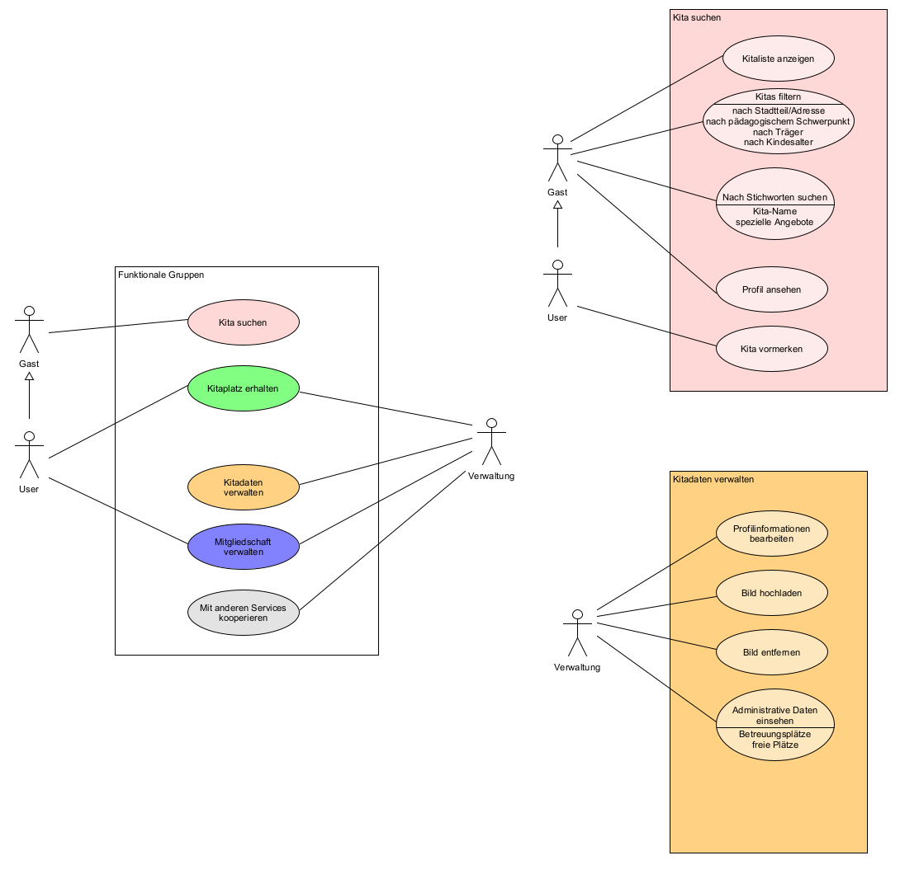
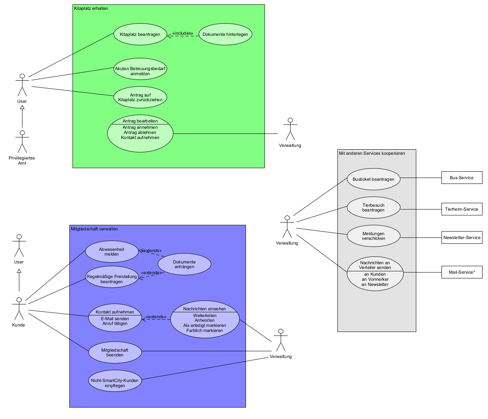
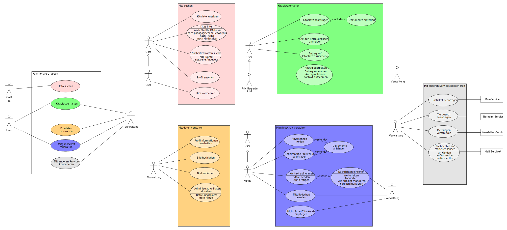

# Kita

**Autor:** Maximilian Hertzke

!> WIP

## Überblick

### Textuelle Beschreibung der Anwendungsdomäne

Der Kita-Microservice dient als Portal für User der SmartCity, die Betreuung für ihre Kinder suchen. 

Jede im SmartCity-Verbund registrierte Kita erhält auf dem Kita-Service eine Seite zur Selbstdarstellung, die Mitarbeiter\*innen der Kita selbst mit Informationen und Bildern bespielen können.
User können eine Liste aller in der SmartCity registrierten Kitas abrufen, die nach Kriterien wie Umkreis, Betreuungsangebot und Träger durchsuchbar bzw. filterbar ist. So lassen sich auch Kitas mit besonderen Betreuungsangeboten finden.
Diese Funktion ist als öffentliche Website auch von Besucher\*innen ohne SmartCity-Account nutzbar.

Im nächsten Schritt können User eines ihrer Kinder bei bis zu drei Kitas auf die Warteliste setzen. Dabei können die zur Erstellung eines Betreuungsvertrages benötigten Dokumente bereits im Voraus hinterlegt und der bearbeitenden Kita zugänglich gemacht werden. Die Kita kann nach Abschluss ihres internen Aufnahmeverfahrens einen Antrag akzeptieren, ablehnen oder Kontakt zum/zur Antragsteller\*in aufnehmen.

Zusätzlich können Kitas vorgemerkt werden, um die Auswahl einzugrenzen oder um ggf. Updates von diesen Kitas per E-Mail zu erhalten.

Kunden einer Kita können bestimmte Vorgänge direkt im SmartCity-Portal erledigen, beispielsweise die Abwesenheit eines ihrer Kinder melden oder aus anderen Gründen mit der Kita Kontakt aufnehmen. Beim dabei können ebenfalls Dokumente angehängt werden, die später, dem entsprechenden Kind zugeordnet, von befugten Mitarbeiter\*innen der Kita eingesehen werden können.

Neben dem Anmeldevorgang per Warteliste können Erziehungsberechtigte in einem separaten Vorgang akuten Betreuungsbedarf anmelden. Privilegierte Ämter wie das Amt für Integration können Anträge auf Betreuungsbedarf mit erhöhter Priorität stellen, die anschließend vom zentralen Kita-Service auf geeignete Kitas verteilt werden.

Darüber hinaus erhält jede registrierte Kita ein Verwaltungstool, mit denen eine Reihe von Aufgaben im Kita-Service erledigt werden kann. So lassen sich Warteliste und Betreuungsverträge verwalten sowie administrative Daten einsehen. In Zusammenarbeit mit den Bus- bzw. Tierheim-Services lassen sich Gruppentickets beantragen oder Tierbesuche organisieren, ebenfalls können aktuelle Nachrichten im Forum-Service veröffentlicht werden.

### Konzeptionelles Analyseklassendiagramm

## Funktionale Anforderungen

### Definition der Akteure
**User:** Erziehungsberechtigte mit SmartCity-Account
- noch nicht Mitglied einer SmartCity-Kita
- nutzt bereits eine oder mehrere Kitas im SmartCity-Verbund

**Verwaltende:** Mitarbeiter\*innen 
- Admin einer Kita-Präsenz
- Verwaltende\*r Mitarbeiter\*in mit eingeschränkten Rechten

**Andere SmartCity-Services**
- Privilegiertes Amt
- (alle Services) --> Datenschutz speziell bei Kindern bedenken, was für Funktionalitäten bleiben übrig?

### Use-Case Diagramme

<!--- 

--->

## Anforderungen im Detail

### User Stories

**Kita suchen**

| **Als** | **möchte ich** | **so dass** | **Akzeptanz** | **Priorität** |
|---|---|---|---|---|
| User | eine Liste aller Kitas anzeigen | ich einen Überblick über das Angebot erhalte | Kitaliste wird angezeigt | Muss |
| User | die Kitas filtern | ich eine meinen Bedürfnissen entsprechende Kita finden kann | passende Kitaliste wird angezeigt | Muss |
| User | die Kitas nach Stichworten durchsuchen | ich Kitas mit bestimmtem Namen oder Angeboten finden kann | passende Kitaliste wird angezeigt | Sollte |
| User | das Profil einer Kita ansehen | ich bestimmen kann, ob die Kita meinen Anforderungen entspricht | Detailansicht gewählter Kita wird angezeigt | Muss |
| User | eine Kita vormerken | ich die Auswahl eingrenzen kann | Vormerken & rückgängig machen, Liste vorgemerkter Kitas wird angezeigt | Muss |
| User | Updates zu vorgemerkten Kitas erhalten | ich während meiner Entscheidungsfindung über Neuigkeiten informiert werde | Nachricht kann an Newsletter\-Service versandt werden | Kann |

**Kitaplatz erhalten**

| **Als** | **möchte ich** | **so dass** | **Akzeptanz** | **Priorität** |
|---|---|---|---|---|
| User | einen Kitaplatz beantragen | mein Kind betreut wird | Antrag wird gespeichert | Muss |
| User | einen Antrag zurückziehen | ich nicht mehr kontaktiert werde | Antrag wird entfernt | Muss |
| User | Dokumente zur Antragsstellung zentral hinterlegen | ich nicht bei jedem Antrag die gleichen Dateien hochladen muss | PDFs werden gespeichert und der gewählten Kita zugänglich gemacht | Kann |
| User | akuten Betreuungsbedarf anmelden | mein Kind kurzzeitig betreut werden kann | Nachricht mit Terminwünschen wird auf Adminseite angezeigt | Kann |
| Verwalter*in | Anträge bearbeiten | neue Kinder in die Kita aufgenommen werden können | Liste mit Anträgen wird angezeigt, Antrag lässt sich annehmen/ablehnen | Muss |
| Verwalter*in | Kontakt mit Antragstellern aufnehmen | ich offene Fragen zu klären kann | Nachricht lässt sich an Antragsteller*in senden | Sollte |

**Mitgliedschaft verwalten**

| **Als** | **möchte ich** | **so dass** | **Akzeptanz** | **Priorität** |
|---|---|---|---|---|
| User | eine Abwesenheit meines Kindes anmelden | die Kita Bescheid weiß (und ich Geld zurückbekomme?) | Nachricht mit Zeiten und ggf. Anhang wird auf Adminseite angezeigt | Sollte |
| User | eine regelmäßige Freistellung meines Kindes anmelden | die Kita Bescheid weiß (und ich Geld zurückbekomme?) | Nachricht mit Zeiten und ggf. Anhang wird auf Adminseite angezeigt | Sollte |
| User | die Kontaktdaten meiner Kitas einsehen | ich eine E\-Mail senden oder einen Anruf tätigen kann | Kontaktdaten der Kita werden unter "Unsere Kitas" angezeigt | Muss |
| User | meinen Kitaplatz aufgeben | mein Vertrag mit der Kita beendet wird | Verwalter werden unterrichtet und das Kind abgemeldet | Muss |
| Verwalter*in | Nachrichten einsehen | ich Kunden antworten kann | Postfach wird angezeigt | Sollte |
| Verwalter*in | Nachrichten organisieren | wir im Team strukturiert arbeitenkönnen | Nachrichten lassen sich markieren | Kann |
| Verwalter*in | Mitgliedschaften beenden |  Änderungen im System eingepflegt werden | Mitgliedschaft lässt sich beenden und wird nachgehalten | Muss |
| Verwalter*in | Kita-Kunden, die nicht an SmartCity teilnehmen, einpflegen | unsere Kita alle Kunden zentral verwalten kann| Kunden lassen sich unabhängig von SmartCity-Account in DB einpflegen und verwalten | Sollte

**Kitadaten verwalten**

| **Als** | **möchte ich** | **so dass** | **Akzeptanz** | **Priorität** |
|---|---|---|---|---|
| Verwalter*in | Profilinformationen meiner Kita bearbeiten | die Informationen im Kita\-Service aktuell bleiben | Kita\-Profildaten lassen sich bearbeiten | Muss |
| Verwalter*in | Profilbilder meiner Kita bearbeiten | die Kita einladend präsentiert wird | Kita\-Bilder lassen sich hinzufügen und entfernen | Sollte |
| Verwalter*in | administrative Daten einsehen | freie und belegte Plätze schnell ersichtlich sind | Platzzustand wird aus Datenbank berechnet | Sollte |
| Verwalter*in | Nachrichten an an Kunden und Vormerker senden  | sie über Vorgänge informiert werden können | Nachricht an User senden | Sollte |
| Verwalter*in | Nachrichten an den Newsletter senden | die Öffentlichkeit über meine Kita informiert und Werbung gemacht wird | Nachricht an Newsletter\-Service senden | Kann |

**Mit Services kooperieren**

| **Als** | **möchte ich** | **so dass** | **Akzeptanz** | **Priorität** |
|---|---|---|---|---|
| Verwalter*in | Bustickets für Gruppen beantragen | Ausflüge mit Kindern gemacht werden können | Antrag auf Busticket an Bus\-Service, Verarbeitung der Rückmeldung | Sollte |
| Verwalter*in | Tierbesuche anmelden | Kinder vor Ort Kontakt mit Tieren haben können | Antrag beim Tierheim, Verarbeitung der Rückmeldung | Sollte |
| Verwalter*in | Besuche im Tierheim anmelden | Ausflüge ins Tierheim organisiert werden können | Antrag beim Tierheim, Verarbeitung der Rückmeldung | Sollte |

**Kitas Administrieren**

| **Als** | **möchte ich** | **so dass** | **Akzeptanz** | **Priorität** |
|---|---|---|---|---|
| Admin | Kita\-Accounts hinzufügen oder deaktivieren | um Kita\-Mitarbeitenden zu unterstützen | Verwaltungsaccounts können erstellt und deaktiviert werden | Muss |
| Admin  | Kitas in der Datenbank hinzufügen oder entfernen | das Angebot in der SmartCity aktuell reflektiert wird | Kitas können in Datenbank gepflegt werden | Sollte |

**Misuse Stories**
...

## Graphische Benutzerschnittstelle
### GUI-Mockups
<!--- 
- Screens mit Überschrift kennzeichnen, die im Inhaltsverzeichnis zu sehen ist
- Unter den Screens darstellen (bzw. verlinken), welche User Stories mit dem Screen abgehandelt werden
- Modellierung der Navigation zwischen den Screens der GUI-Mockups als Zustandsdiagramm
- Mockups für unterschiedliche Akteure
--->

## Datenmodell 
### ER-Diagramm

<!---
- Begriffe im Glossar darstellen
- Modellierung des physikalischen Datenmodells 
  - RDBMS: ER-Diagramm bzw. Dokumentenorientiert: JSON-Schema
  --->
  

### Glossar
| **Model** | **API route** |
| :------ | :------	|
| Einrichtung | kitas	|
| Bild		  | images	|
| Antrag 	  | applications |
| Vertrag 	  | contracts |
| Kind		  | children |
| Erziehungsberechtigte | guardians |
| Mitarbeitende | employees |
| Dokument | documents |
| Nachricht | messages |

## Abläufe

<!---
- Aktivitätsdiagramm für den Ablauf sämtlicher Use Cases
- Aktivitätsdiagramme für relevante Use Cases
- Aktivitätsdiagramm mit Swimlanes sind in der Regel hilfreich 
  für die Darstellung der Interaktion von Akteuren der Use Cases / User Stories
- Abläufe der Kommunikation von Rechnerknoten (z.B. Client/Server)
  in einem Sequenz- oder Aktivitätsdiagramm darstellen
- Modellieren Sie des weiteren die Diagramme, die für das (eigene) Verständnis des
  Softwaresystems hilfreich sind. 
--->

## Schnittstellen

### APIs
!> WIP: unvollständig
#### Private
| **Methode** | **Name** | **Parameter** | **Resultat** |
| :------ | :----- | :------ | :------ |
Datensätze anlegen
| POST | createApplication() | int id_einrichtung, int id_kind, int id_ezb, date datum, int priority, str status | response status code |
| GET | getApplications() | int id_ezb | return alle aktuellen Anträge des Users |
| DELETE | deleteApplication() | int id_antrag, int id | Antrag wird gelöscht |
| POST | createContract() | int id_einrichtung, int id_kind, int id_ezb, (date beginn), (date ende), int betreuungsstunden | Neuer Vertrag wird angelegt |
| GET | getContractsUser() | int id_ezb | return alle aktuellen Verträge des Users |
| GET | getContractsKita() | int id_kita | return alle aktuellen Verträge der Kita |
| PATCH | terminateContract() | int id_vertrag, date ende | Enddatum des Vetrags wird verändert |
Watchlist
| PUT | addKitaToWatchlist() | int id_ezb, int id_einrichtung | Kita wird den vorgemerkten Kitas des Users hinzugefügt |
| PATCH | removeKitaFromWatchlist() | int id_ezb, int id_einrichtung | Kita wird aus den vorgemerkten Kitas des Users entfernt | 

#### Public
...

- Auflistung der nach außen sichtbaren Schnittstelle des Microservices. Über welche Schnittstelle kann z.B. der Client den Server erreichen?
- In Event-gesteuerten Systemen ebenfalls die Definition der Ereignisse und deren Attribute
- Aufteilen in Commands, Events, Queries
- Abhängigkeiten: Liste mit Kommunikationsabhängigkeiten zu anderen Microservices

**Beispiel:**

### URL

http://smart.city/microservices/kita

### Commands

**Synchronous**

| **Name** | **Parameter** | **Resultat** |
| :------ | :----- | :------ |
| createCustomer() | int id | int id |
| deleteOrder() | int id | int id |

**Asynchronous**

| **Name** | **Parameter** | **Resultat** |
| :------ | :----- | :------ |
| createContract() | int id | int id |
| changeContract() | int id | - |

### Events

**Customer event channel**

| **Name** | **Payload** | 
| :------ | :----- | 
| Customer Authorized | int id |
| Customer Deleted | int id |

**Contract event channel**

| **Name** | **Payload** | 
| :------ | :----- | 
| Contract Received | int id |
| Contract Deleted | int id |

### Queries

| **Name** | **Parameter** | **Resultat** |
| :------ | :----- | :------ |
| getContracts() | - | Contract [] list |
| getContract() | int id | Contract c |

### Dependencies

#### RPC

| **Service** | **Funktion** |
| :------ | :----- | 
| Authorization Service | authenticateUser() |
| Hospital Service | blockDate() |

#### Event-Subscriptions

| **Service** | **Funktion** |
| :------ | :----- | 
| Cinema channel | CancelFilmCreatedEvent |
| Customer reply channel | CreateCustomerEvent |

#### Abhängigkeiten zu anderen Services in Textform
- Bürgerbüro: vermutlich starke Abhängigkeit, benötige sicheren Zugriff auf persönliche Daten aus der Datenbank des Bürgerbüros
- Amt für Integration: schwache Abhängigkeit, biete Beantragung von Kita-Plätzen mit Unterstützung durch das AfI (z.B. Geflüchtete) mit erhöhter Priorität
- Bus-Service: schwache Abhängigkeit, benötige Beantragung von Gruppentickets durch Verwaltungsmitarbeiter\*innen
- Tierheim: schwache Abhängigkeit, benötige Terminvereinbarung für einen Tierbesuch
- Forum: schwache Abhängigkeit, biete Inhalte für Newsletter & Schwarzes Brett

<!---
Aus Meeting:
- Jonathan erhält von mir Zugangsschlüssel mit sehr hohen Rechten (darf immer Userdaten abfragen etc.)
- Userdaten: ich speichere bei SmartCity-Mitgliedern nur die user_id und frage alles andere beim BB ab
- falls Familienrelation seitens BB nicht funktioniert: Eltern geben Kindesdaten selbst ein, ich prüfe beim BB ob das Kind dort vorhanden ist und EZB-Frage muss (imaginär) von Kitamitarbeitenden geklärt werden
- bei allen Elementen, wo eine Liste mehrerer User angezeigt wird, Loading spinner implementieren da Ladezeiten länger werden könnten
--->

## Technische Umsetzung

### Softwarearchitektur

- Darstellung von Softwarebausteinen (Module, Schichten, Komponenten)

Hier stellen Sie die Verteilung der Softwarebausteine auf die Rechnerknoten dar. Das ist die Softwarearchitektur. Zum Beispiel Javascript-Software auf dem Client und Java-Software auf dem Server. In der Regel wird die Software dabei sowohl auf dem Client als auch auf dem Server in Schichten dargestellt.

* Server
  * Web-Schicht
  * Logik-Schicht
  * Persistenz-Schicht

* Client
  * View-Schicht
  * Logik-Schicht
  * Kommunikation-Schicht

Die Abhängigkeit ist bei diesen Schichten immer unidirektional von "oben" nach "unten". Die Softwarearchitektur aus Kapitel "Softwarearchitektur" ist demnach detaillierter als die Systemübersicht aus dem Kapitel "Systemübersicht". Die Schichten können entweder als Ganzes als ein Softwarebaustein angesehen werden. In der Regel werden die Schichten aber noch weiter detailliert und in Softwarebausteine aufgeteilt. 

### Entwurf

- Detaillierte UML-Diagramme für relevante Softwarebausteine

### Fehlerbehandlung 

* Mögliche Fehler / Exceptions auflisten
* Fehlercodes / IDs sind hilfreich
* Nicht nur Fehler technischer Art ("Datenbankserver nicht erreichbar") definieren, sondern auch fachliche Fehler wie "Kunde nicht gefunden", "Nachricht wurde bereits gelöscht" o.ä. sind relevant. 

### Validierung

* Relevante (Integrations)-Testfälle, die aus den Use Cases abgeleitet werden können
* Testfälle für 
  - Datenmodell
  - API
  - User Interface
* Fokussieren Sie mehr auf Integrationstestfälle als auf Unittests
* Es bietet sich an, die IDs der Use Cases / User Stories mit den Testfällen zu verbinden,
  so dass erkennbar ist, ob Sie alle Use Cases getestet haben.

### Verwendete Technologien

* Frontend: Vue.js
* Backend: Express.js + Node.js, Multer
* Datenbank: mySQL
